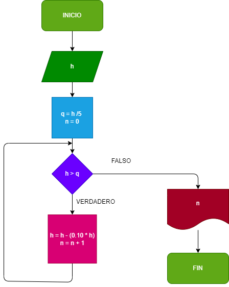

### Ejercicio N° 1

### una pelota se deja caer desde una altura h y en cada rebote sube el 10% menos del anterior hacer el diagrama de flujo y el diagrama en python que lea h y que calcule y imprima en cual rebote no alcanza a subir la quinta parte de la altura inicial.

## DIAGRAMA DE FLUJO
